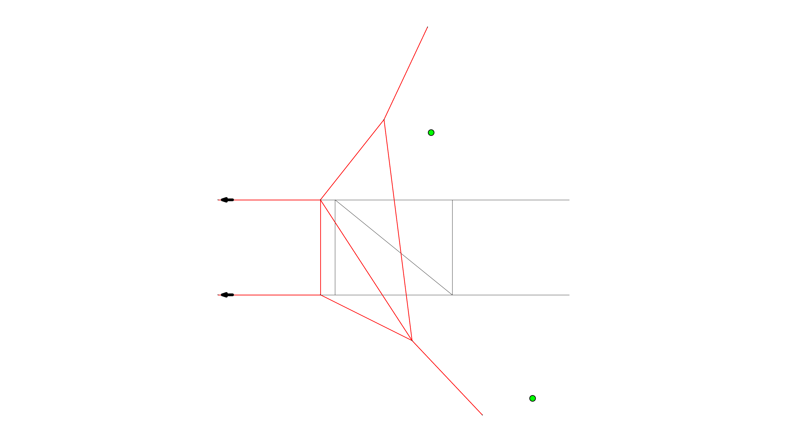

# compas_cem

A **COMPAS**-flavored combinatorial equilibrium modeling (CEM).




## Getting Started

CEM is a geometric form-finding technique to create mixed tension-compression
structures. This **COMPAS** package is developed by Rafael Pastrana at the
CREATE Laboratory at [Princeton University](https://soa.princeton.edu/) in
collaboration with CEM's original authors, Patrick Ole Ohlbrock and Pierluigi
D'Acunto, from the Chair of Structural Design at [ETH Zürich](http://www.schwartz.arch.ethz.ch/).

If you are curious about CEM's underpinnings, we refer you to these three
excellent resources:

- The [journal
paper](https://www.sciencedirect.com/science/article/abs/pii/S0010448519305342)
- The [condensed
notes](https://github.com/arpastrana/compas_cem/tree/master/cem_method.md) in
this repository
- The first Rhino/Grasshopper [CEM
implementation](https://github.com/OleOhlbrock/CEM/) by Ole and Pierluigi.

Additionally, feel free to check this [first
example](https://github.com/arpastrana/compas_cem/tree/master/scripts/01_hello_world.py)
to get a first impression of what `compas_cem` can do for you.

# Example

## Installation

The preferred way to install `compas_cem` is to build it from source in only four simple steps.

First, create a new `conda` environment from your command line. The only requirements (until now) are `python`, `compas`, and `rtree` .

```bash
conda create -n cem python=3.7 COMPAS=0.16.2 rtree=0.9.4
conda activate cem
```

We need to fetch `compas_cem` from this repository. Go to the folder where you want to store it and run the following. For example, if you are a macOS user and want to put it in the pre-existing `~/code/` folder:

```bash
cd ~/code/
git clone https://github.com/arpastrana/compas_cem.git
```

Next, Move into the the repository's folder (the one you've just cloned) and install `compas_cem` using `pip`:

```bash
cd compas_cem
pip install -e .
```

To double-check that everything is up and running, still in your command line
interface, type the following and hit enter:

```bash
python -c "import compas_cem"
```

If no errors show up, celebrate 🎉! You have a working installation of `compas_cem`.

## Contributing

Pull requests are welcome! 

Make sure to read our [contribution
guide](https://github.com/arpastrana/compas_cem/tree/master/CONTRIBUTING.md).
Please don't forget to run ``invoke test`` in your command line before making a
pull request.

## Issue tracker

If you find a bug or want to suggest a potential enhancement,
please help us tackle it by [filing a report](https://github.com/arpastrana/compas_cem/issues).


## License

MIT.
