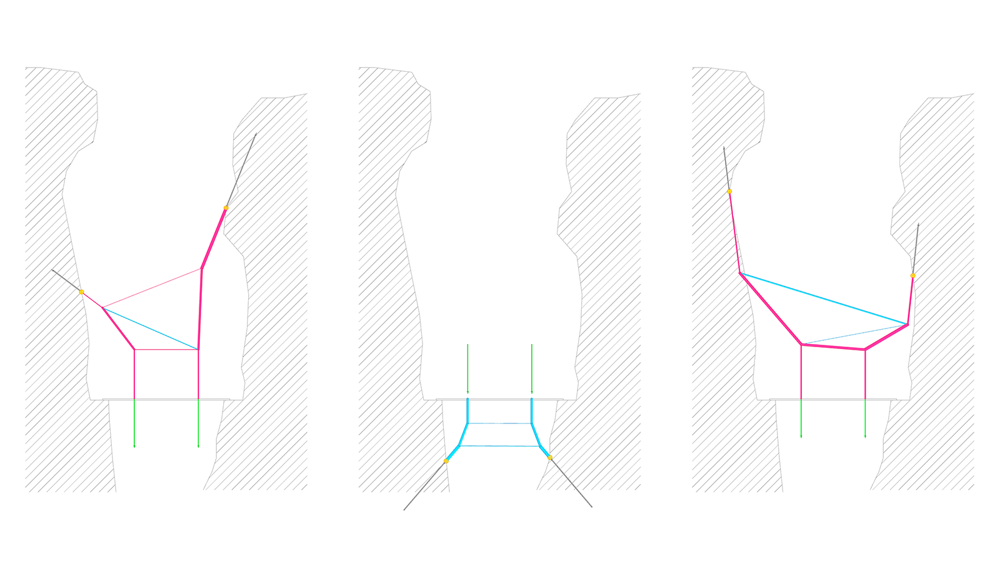
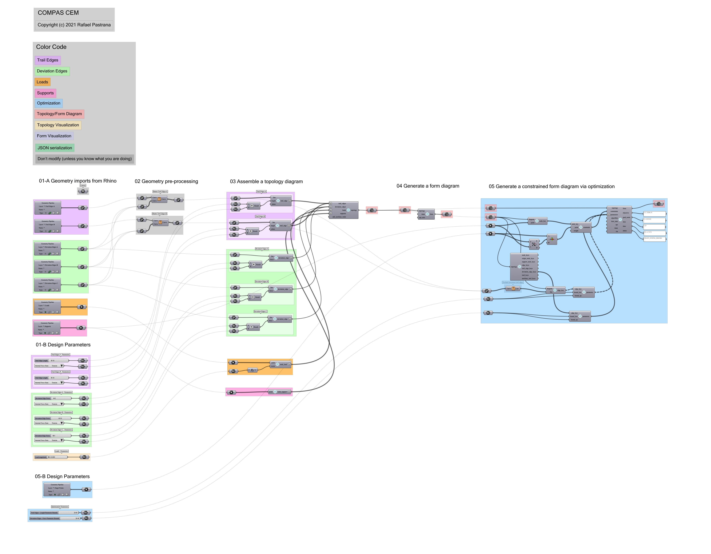

================================================================================
A. Bridge in 2D
================================================================================

.. note::

   Download the `Rhino file here <https://github.com/arpastrana/compas_cem/blob/main/examples/ghpython/bridge_2d.3dm>`_.
   Download the `Grasshopper file here <https://github.com/arpastrana/compas_cem/blob/main/examples/ghpython/bridge_2d.ghx>`_.

