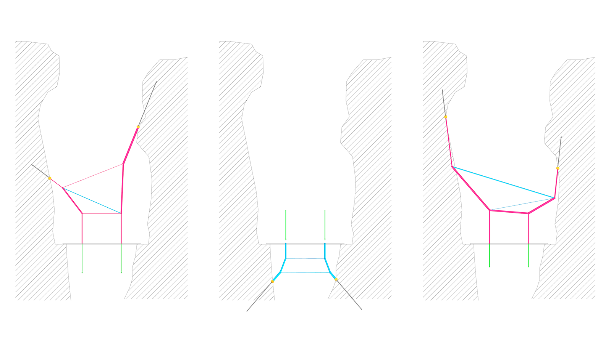
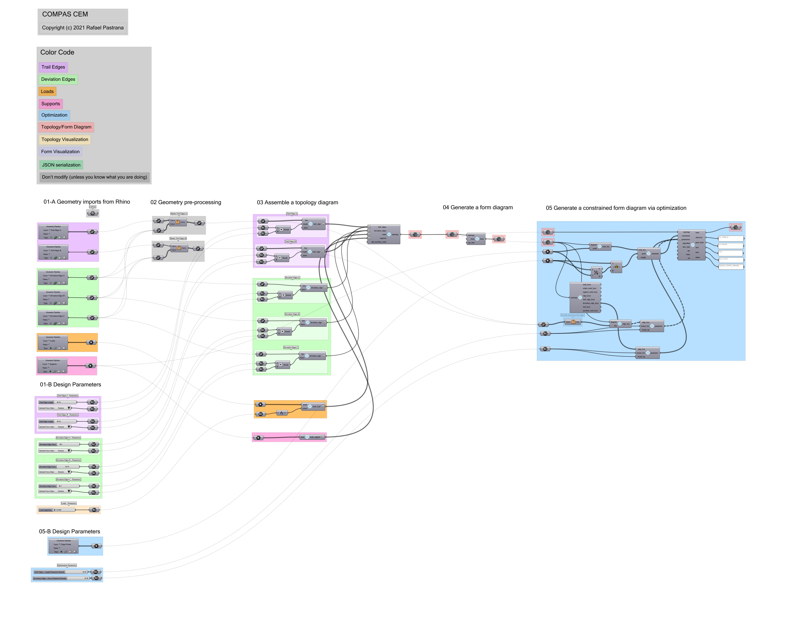

# A. Bridge in 2D

!!! note

    Download the [Rhino file](https://github.com/arpastrana/compas_cem/blob/main/examples/ghpython/bridge_2d.3dm).
    Download the [Grasshopper file](https://github.com/arpastrana/compas_cem/blob/main/examples/ghpython/bridge_2d.ghx).

