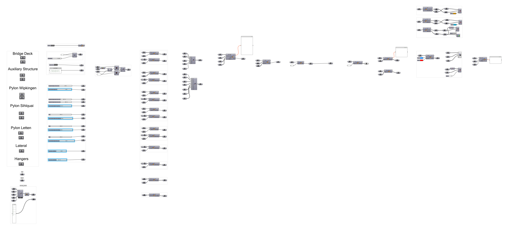

================================================================================
05. Long-Span Bridge in 3d (Grasshopper)
================================================================================

.. figure:: ../_images/front_cover.png
    :figclass: figure
    :class: figure-img img-fluid

Download the grasshopper file :download:`here <../../examples/04_bridge_letten.ghx>`.

To load the resulting bridge from a pre-baked ``.json`` file, and to display it
with ``compas_viewers``, use the next script.

.. note::
	Requires ``compas_viewers`` for visualization.

.. literalinclude:: ../../examples/04_bridge_letten.py
